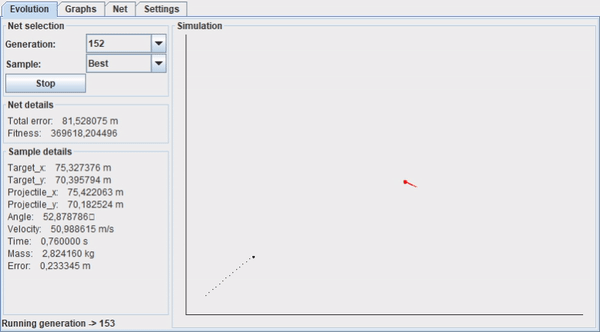

# Learning of a mobile-targets projectile-thrower through neural networks - Università degli Studi di Roma, La Sapienza - Bachelor Thesis - Computer Science

**Supervisor:** [Prof. Andrea Sterbini](http://twiki.di.uniroma1.it/twiki/view/Users/AndreaSterbini)  
**Student:** Alessio Quercia  

## Overview
The current repository has been created to keep track of my graduation thesis' project on Neuroevolution. The project's main goal was to evolve the skills of launcher (controlled by neural networks) to hit a target, throwing projectiles of variable weight. More in detail the goal was to train the neural network associated to a launcher to hit a given target, where the throws are evaluated as good as closer to its target, and to show the results in a simulation. A genetic algorithm (NEAT) has been used to train the neural networks and Java Swing has been used to create an interface and to show the simulations obtained by the networks during the training phase and also after that, by loading already trained neural networks (with the possibility to change their inputs).

**Note:** This README is intended to show in broad terms the project and it's not the thesis itself.

## Execution instructions

The project code is a little bit messy. Follow these (tested) instructions to run the code:

1. Open the project with IntelliJ IDEA or Eclipse.
2. Set Java 1.8 as JDK.
3. Add tools.jar as external library.
4. Set *NeuroEvo\Neuroevolution\src\gui* as working directory.
5. Run *NeuroEvo\Neuroevolution\src\newGui\NewMainGui.java*.

## Demo

## Libraries
To achieve the project goal, I decided to use a peculiar genetic algorithm, called NEAT, which allows not only to train neural networks' weights, but also their structures during the evolution process. I chose Java as programming language, thus I used the Java version of the NEAT (NeuroEvolution of Augmenting Topologies) method, [JNEAT](http://nn.cs.utexas.edu/?jneat), written by Ugo Vierucci and based on the [original C++ package](http://nn.cs.utexas.edu/?neat_original) by [Kenneth Stanley](http://www.cs.ucf.edu/~kstanley/).
To develop the GUI showing neural networks' simulations, info and graphs I used Java Swing. Some GUI screenshots are showed below.

## GUI screenshots

**Loaded trained neural network.**

**The fitness chart related to that evolution process.**

**The neural network producing that result**

## Development steps

The main goal was to train a neural network to be able to hit a moving target with a linear motion.

To achieve the goal, the problem has been divided into multiple sub-problems, solved in different development steps, briefly described below. 

To each neural network were given 10 different input samples, corresponding to 10 targets (with different positions and, in case of moving target, with different velocity).

### Step I
Fixed target with random x and constant y.

Neural networks inputs:

- x

Neural networks outputs:

- angle
- velocity

Error function:

  

Fitness function:

  

where n is the samples number for each neural network.

### Step II

Fixed target with random x and random y.

Neural networks inputs:

- x
- y

Neural networks outputs:

- angle
- velocity

Error function:

  

Fitness function:

  

where n is the samples number for each neural network and k is a constant (k = 0.01) which allows to compute the fitness even when the error is zero and gives an upper bound to the fitness, which in this case may be at most 100 per sample and 1000 in total.

### Step III
Fixed target with random x and random y.

Neural networks inputs:

- x
- y
- projectile mass

Neural networks outputs:

- angle
- force
- throw time

Error function:

  

Fitness functions:

  

  

where n is the samples number for each neural network and K is a constant (K = 1000000) representing the maximum fitness.

### Step IV
Fixed target with random x and random y. 

From this step on the neural networks had to simulate the throw decision, deciding the angle and the force to use to hit the target in a 2 seconds loop. If they were ready before the 2 seconds, they could set the 'stop' boolean to stop the loop and throw the projectile with the chosen angle and force. After a loop step, the velocity in input was updated according to the previous angle and force outputs.

Neural networks inputs:

- x
- y
- velocity (t - 1)

Neural networks outputs:

- angle
- force
- 'stop' boolean

Error function:

  

Fitness functions:

  

  

where n is the samples number for each neural network and K is a constant (K = 1000000) representing the maximum fitness.

### Step V
Fixed target with random x and random y.

Neural networks inputs:

- x
- y
- velocity (t - 1)
- angle (t - 1)
- force (t - 1)

Neural networks outputs:

- angle
- force
- throw time

Error function:

  

where d(x) is the minimum distance between a point and a parabola.

  

and

  

  

with

  

the parabola equation.

Fitness functions:

  

where n is the samples number for each neural network, k is a constant and

  

where

  

with

  

and

  

### Step VI
Moving target with random x and random y and random velocity (and direction).

Neural networks inputs:

- x
- y
- velocity (t - 1)
- angle (t - 1)
- force (t - 1)

Neural networks outputs:

- angle
- force
- throw time

Error function:

  

where d(x) is the minimum distance between a body moving with projectile motion and one moving with linear motion.

Fitness functions:

  

### Step VII
Moving target with random x and random y and random velocity (and direction).

Neural networks inputs:

- x
- y
- x (t - 1)
- y (t - 1)
- x (t - 2)
- y (t - 2)
- velocity (t - 1)
- angle (t - 1)
- force (t - 1)

Neural networks outputs:

- angle
- force
- throw time

Error function:

  

where d(x) is the minimum distance between a body moving with projectile motion and one moving with linear motion.

Fitness functions:

  

## Possible future work
- Improve error and fitness computation.
- New steps:
  - Moving target with projectile motion.
  - Moving target with random motion.
  - Moving launcher (variable initial position of the projectile launcher and moving while deciding how to throw and while throwing the projectile).
- Make a 3D GUI.

## References
 1. Kenneth O. Stanley, Risto Mikkulainen - Evolving Neural Networks through Augmenting Topologies, MIT Press Journals, 2002.
2. Risto Mikkulainen - Neuroevolution, In Encyclopedia of Machine Learning, New York: Springer, 2010.
3. Kenneth O. Stanley - NEAT Software Doc File, 2001.
    http://nn.cs.utexas.edu/?neat_original
4. NeuroEvolution of Augmenting Topologies (NEAT) Users Page.
    https://www.cs.ucf.edu/~kstanley/neat.html
5. Ugo Vierucci, NEAT Java (JNEAT), 2002.
    http://nn.cs.utexas.edu/?jneat
6. Java Foundation Classes (JFC) – Swing documentation.
    https://docs.oracle.com/javase/7/docs/api/javax/swing/package-summary.html
7. Java OpenGL Math Library (JOML).
    https://github.com/JOML-CI
8. Michele Impedovo – Colpire il bersaglio, in IPOTESI, 1998.
9. Antimo Palano – La nuova fisica: Meccanica.
    http://www.ba.infn.it/~palano/chimica/book/it/Fisica.html
10. Rosario Cantelli – Lezioni di fisica. Meccanica e termodinamica, Roma: Scione editore, 2007.
11. Genetic Science Learning Center, Learn.Genetics, Basic genetics.
      http://learn.genetics.utah.edu/content/basics

